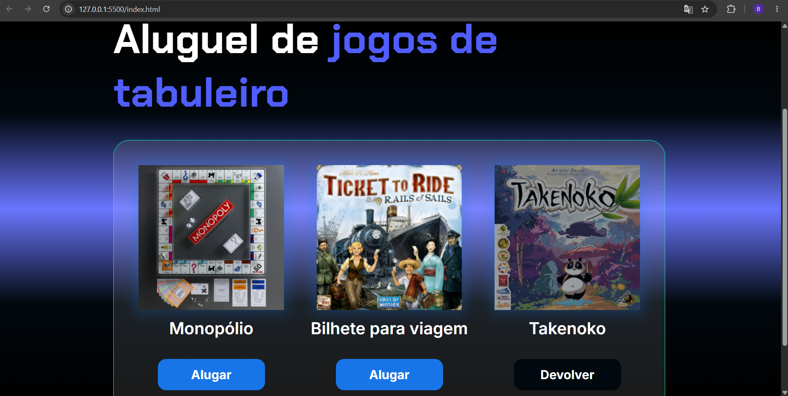

# 🎮 AluGames

## 📖 Sobre o projeto

O **AluGames** foi desenvolvido durante o curso **Lógica de Programação com JavaScript**, da Alura.

A aplicação simula um sistema de aluguel de jogos, permitindo alterar dinamicamente o status de cada jogo entre **Alugar** e **Devolver**, atualizando automaticamente o botão e a aparência da interface.

Durante o desenvolvimento foram aplicados conceitos fundamentais de JavaScript, como manipulação do DOM, seleção de elementos, alteração de classes CSS e atualização dinâmica da interface.

---

## 🚀 Funcionalidades

- ✅ Alugar um jogo;
- ✅ Devolver um jogo;
- ✅ Alterar o texto do botão automaticamente;
- ✅ Modificar o estilo visual do jogo alugado;
- ✅ Atualizar a interface em tempo real.

---

## 🛠️ Tecnologias utilizadas

- HTML5
- CSS3
- JavaScript

---

## 💡 Conceitos praticados

Durante o desenvolvimento deste projeto foram utilizados conceitos como:

- Manipulação do DOM;
- querySelector();
- classList.add();
- classList.remove();
- Estruturas condicionais;
- Template Literals;
- Atualização dinâmica da interface.

---

## 📂 Estrutura do projeto

```text
📦 alugames
 ┣ 📂 assets
 ┣ 📜 index.html
 ┣ 📜 style.css
 ┣ 📜 app.js
 ┗ 📜 README.md
```

---

## ▶️ Como executar

1. Clone este repositório:

```bash
git clone <SEU-LINK-DO-REPOSITÓRIO>
```

2. Abra o arquivo `index.html` em seu navegador.

---

## 📚 Aprendizados

Este projeto contribuiu para o desenvolvimento das seguintes habilidades:

- Manipulação de elementos HTML utilizando JavaScript;
- Alteração dinâmica de classes CSS;
- Atualização automática da interface;
- Organização da lógica em funções;
- Desenvolvimento de interações entre usuário e aplicação.

---

## 📷 Demonstração



---

## 👩‍💻 Desenvolvido por

**Bruna Soares de Almeida**

🔗 GitHub: https://github.com/brunasalmeida-dev

🔗 LinkedIn: https://www.linkedin.com/in/bruna-soares-de-almeida-7b4bb8412
